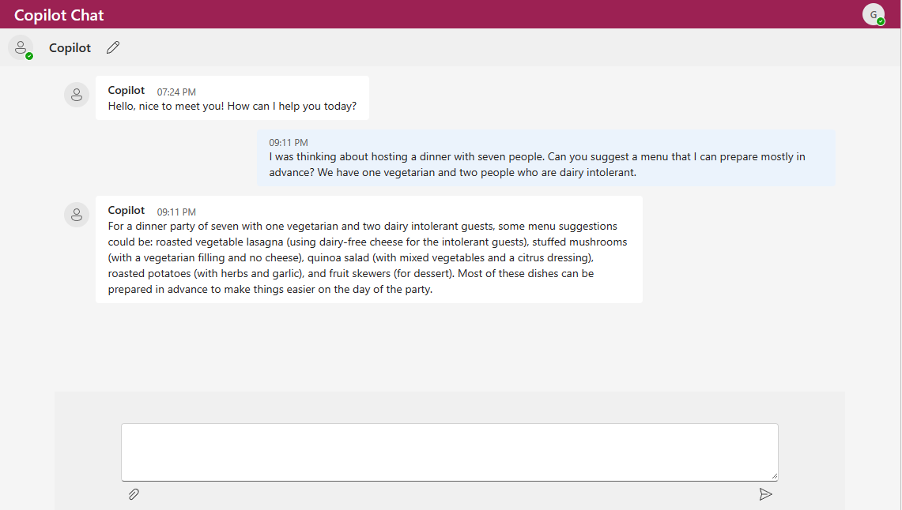
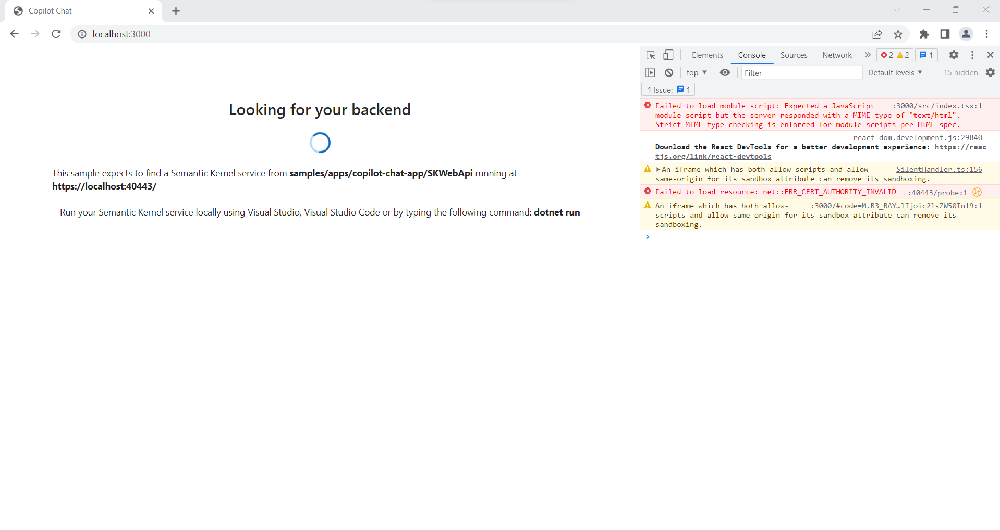

# Copilot Chat Sample Application
> This  sample is for educational purposes only and is not recommended for production deployments.

# About Copilot Chat
This sample allows you to build your own integrated large language model chat copilot.
This is an enriched intelligence app, with multiple dynamic components including 
command messages, user intent, and memories.

The chat prompt and response will evolve as the conversation between the user and the application proceeds. 
This chat experience is orchestrated with Semantic Kernel and a Copilot Chat skill containing numerous
functions that work together to construct each response.



# Configure your environment
Before you get started, make sure you have the following requirements in place:
- [.NET 6.0 SDK](https://dotnet.microsoft.com/download/dotnet/6.0)
- [Node.js](https://nodejs.org/)
- [Yarn](https://yarnpkg.com/)
- [Visual Studio Code](https://code.visualstudio.com/Download) **(Optional)** 
- [Azure OpenAI](https://aka.ms/oai/access) resource or an account with [OpenAI](https://platform.openai.com).

Or try the installation scripts from here: [Install-Requirements](scripts/Install-Requirements.ps1)
# Start the app
You can run the app by running start scripts [Start.ps1](scripts/Start.ps1) or [Start.sh](scripts/Start.sh), or alternatively you can follow steps below to start webapi and webapp separately:
## Step-by-step instructions to run the webapi and webapp:
The sample uses two applications, a front-end web UI, and a back-end API server.
First, let’s set up and verify the back-end API server is running.

1. Generate and trust a localhost developer certificate. Open a terminal and run:
   - For Windows and Mac run `dotnet dev-certs https --trust` and select `Yes` when asked if you want to install this certificate.
   - For Linux run `dotnet dev-certs https`
   > **Note:** It is recommended you close all instances of your web browser after installing the developer certificates.

1. Navigate to `samples/apps/copilot-chat-app/webapi` and open `appsettings.json`
   - Update the `Completion`, `Embedding`, and `Planner:AIService` (if enabled) configuration sections:
     - Update `AIService` to the AI service you will be using (i.e., `AzureOpenAI` or `OpenAI`).
     - If your are using Azure OpenAI, update `Endpoint` to your Azure OpenAI resource Endpoint address (e.g.,  
       `http://contoso.openai.azure.com`).
        > If you are using OpenAI, this property will be ignored.
     - Set your Azure OpenAI key by opening a terminal in the webapi project directory and using `dotnet user-secrets`
       ```bash
       cd semantic-kernel/samples/apps/copilot-chat-app/webapi
       dotnet user-secrets set "Completion:Key" "MY_AZUREOPENAI_OR_OPENAI_KEY"
       dotnet user-secrets set "Embedding:Key" "MY_AZUREOPENAI_OR_OPENAI_KEY"
       ```
     - Update `DeploymentOrModelID` to the Azure OpenAI deployment or OpenAI models you want to use. 
       - For `Completion` and `Planner:AIService`, CopilotChat is optimized for Chat completion models, such as gpt-3.5-turbo and gpt-4.
         > **Important:** gpt-3.5-turbo is normally labelled as "`gpt-35-turbo`" (no period) in Azure OpenAI and "`gpt-3.5-turbo`" (with a period) in OpenAI.
       - For `Embedding`, `text-embedding-ada-002` is sufficient and cost-effect for generating embeddings.   


1. Build and run the back-end API server
    1. Open a terminal and navigate to `samples/apps/copilot-chat-app/webapi`
    
    1. Run `dotnet build` to build the project.
    
    1. Run `dotnet run` to start the server.
    
    1. Verify the back-end server is responding, open a web browser and navigate to `https://localhost:40443/probe`
       > The first time accessing the probe you may get a warning saying that there is a problem with website's certificate. 
         Select the option to accept/continue - this is expected when running a service on `localhost`
         It is important to do this, as your browser may need to accept the certificate before allowing the frontend to communicate with the backend.

      > You may also need to acknowledge the Windows Defender Firewall, and allow the app to communicate over private or public networks as appropriate.
 
1. Build and start the front-end application
   1. To build and run the front-end application
      ```bash
      yarn install
      yarn start
      ```
   
   1. With the back end and front end running, your web browser should automatically launch and navigate to `http://localhost:3000`
      > The first time running the front-end application may take a minute or so to start.

1. Have fun! 
   > **Note:** Each chat interaction will call Azure OpenAI/OpenAI which will use tokens that you may be billed for.

## Troubleshooting
### 1. Localhost SSL certificate errors


If you are stopped at an error message similar to the one above, your browser may be blocking the front-end access 
to the back end while waiting for your permission to connect. To resolve this, try the following:

1. Confirm the backend service is running by opening a web browser, and navigating to `https://localhost:40443/probe`
   - You should see a confirmation message: `Semantic Kernel service is up and running`
1. If your browser asks you to acknowledge the risks of visiting an insecurewebsite, you must acknowledge the 
   message before the front end will be allowed to connect to the back-end server. 
   - Acknowledge, continue, and navigate until you see the message Semantic Kernel service is up and running
1. Navigate to `https://localhost:3000` or refresh the page to use the Copilot Chat application.

### 2. Issues using text completion models, such as `text-davinci-003`
As of [PR #499](https://github.com/microsoft/semantic-kernel/pull/499), CopilotChat now focuses support on chat completion models, such as `gpt-3.5-*` and `gpt-4-*`
See [OpenAI's model compatiblity](https://platform.openai.com/docs/models/model-endpoint-compatibility) for
the complete list of current models supporting chat completions.

## Additional resources

1. [Import Document Application](./importdocument/README.md): Import a document to the memory store.
